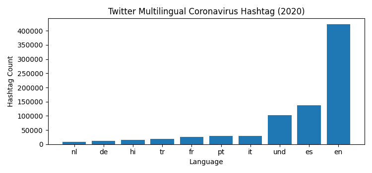
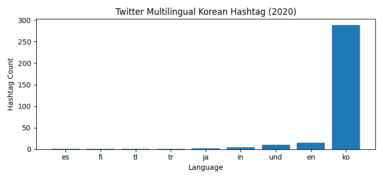
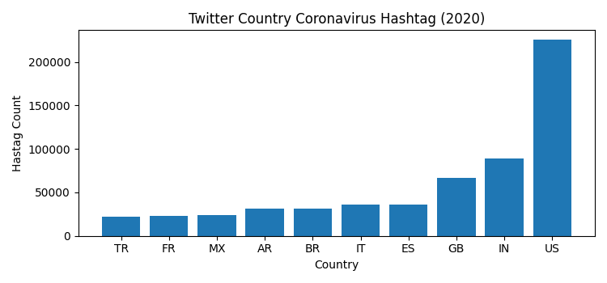
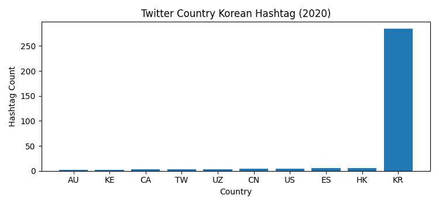

# Coronavirus twitter analysis

## Summary
This project, completed as part of Claremont McKenna College's CS046 Data Structures and Algorithms course taught by Mike Izbicki, aims to monitor the spread of the coronavirus on social media by scanning all geotagged tweets sent in 2020. To handle the large volume of data, the project employs the MapReduce divide-and-conquer paradigm to create parallel code.

## Background

**About the Data:**

Approximately 500 million tweets are sent everyday.
Of those tweets, about 2% are *geotagged*.
That is, the user's device includes location information about where the tweets were sent from.
The lambda server's `/data/Twitter dataset` folder contains all geotagged tweets that were sent in 2020.
In total, there are about 1.1 billion tweets in this dataset.

The tweets are stored as follows.
The tweets for each day are stored in a zip file `geoTwitterYY-MM-DD.zip`,
and inside this zip file are 24 text files, one for each hour of the day.
Each text file contains a single tweet per line in JSON format.
JSON is a popular format for storing data that is closely related to python dictionaries.

## Explanation & Process

To analyze Twitter data related to the coronavirus, I first created a 'map.py' file that tracks the usage of a specific list of hashtags on both a language and country level. This list of hashtags helped to filter and organize the tweets to better understand the patterns and trends around the coronavirus.

The next step was to handle the large volume of data that would result from this process. To do this, I utilized a shell script that made use of the 'nohup' and '&' operators. These operators ensured that the program continued to run after I disconnected and that all the commands ran in parallel, allowing for faster processing times.

After the data was gathered, I used a provided 'reduced.py' file to combine all of the language and country files into a single file. This allowed for easier analysis of the data as it was now consolidated into two files.

I then modified a 'visualize.py' file to output the bar charts. The resulting graphs displayed the top hashtags used for each language and country in 2020, sorted from low to high.

Finally, I created the 'alternativereduce.py' file to produce the line chart seen in the results. This file used the same data from the 'map.py' file and 'reduce.py' file, but instead created a line chart to show the trend in the number of tweets related to the coronavirus over time.

To conclude, this process allowed me to gain insights into the usage of coronavirus-related hashtags on Twitter and to visualize the data effectively and efficiently. 

## Graphs

## Graph Analysis

### Twitter Multilingual Coronavirus Hashtag Data (2020)

This graph illustrates the frequency of the hashtag '#coronavirus' across different languages on Twitter during the year 2020. The graph displays the total number of times the hashtag was used in each language supported by Twitter.It is evident from the graph that the hashtag '#coronavirus' was tweeted most frequently in English as compared to other languages, accounting for a substantial proportion of the total tweets related to the pandemic. This finding highlights the global impact of the pandemic and the widespread use of Twitter as a platform for expressing thoughts, opinions, and updates on this critical issue.The graph not only provides insight into the overall usage of the hashtag, but it also demonstrates the importance of language in online communication and how it can influence the spread of information and discourse around an issue.

### Twitter Multilingual Korean Hashtag Data (2020)

The graph illustrates the frequency with which the Korean hashtag +코로나바이러스 was used on Twitter in 2020 across various languages. Each language is represented by a bar, and the height of each bar corresponds to the total number of times the hashtag was used in that language.It is evident from the graph that the hashtag was most frequently used in Korean, followed by other languages supported by Twitter. Specifically, the graph shows that the Korean language dominates in the use of this hashtag, suggesting that there was a higher level of interest or engagement with the COVID-19 outbreak in Korea, at least on Twitter. This information can provide insights into the language preferences and patterns of Twitter users regarding the COVID-19 outbreak in 2020.

### Twitter Country Coronavirus Hashtag Data (2020)

This graph represents the usage frequency of the hashtag '#coronavirus' on Twitter throughout 2020, across various countries supported by the platform. The graph presents a comparison of the total number of times the hashtag was used in each country, offering insights into the prevalence of discussions related to the COVID-19 pandemic.According to the graph, the United States has the highest number of tweets containing the '#coronavirus' hashtag, indicating that the topic was highly relevant and actively discussed on the platform within the country. India and Great Britain follow closely behind, suggesting that the pandemic was also a significant concern in these countries.The graph provides a visual representation of the global impact of the pandemic on social media, highlighting the countries where discussions on the topic were most prevalent. This data can be used to identify trends, track the spread of the virus, and inform public health initiatives and policies.

### Twitter Country Korean Hashtag Data (2020)

This figure presents a visualization of the usage frequency of the Korean hashtag #코로나바이러스 (which translates to "#coronavirus" in English) on Twitter throughout 2020, across various countries supported by the platform. The graph provides a comparative analysis of the total number of times the hashtag was used in each country, offering insights into the prevalence of discussions related to the COVID-19 pandemic within different regions. As per the graph, the highest number of tweets containing the #코로나바이러스 hashtag was observed in South Korea, indicating that the topic was highly relevant and actively discussed on the platform within the country. Hong Kong and Spain follow closely behind, suggesting that the pandemic was also a significant concern in these countries.
  
